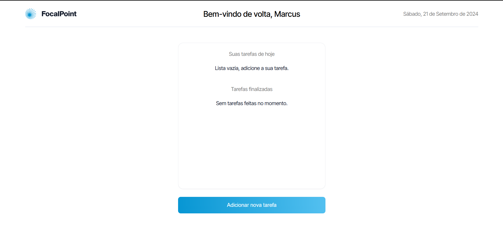
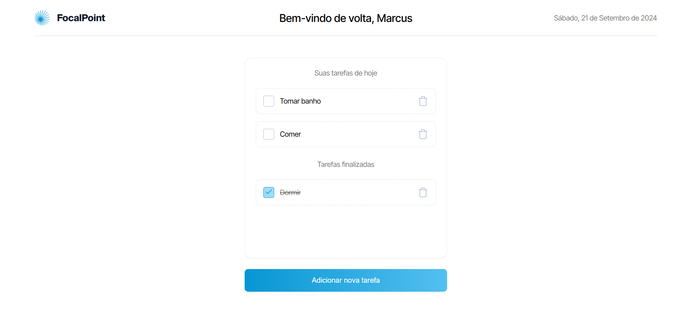
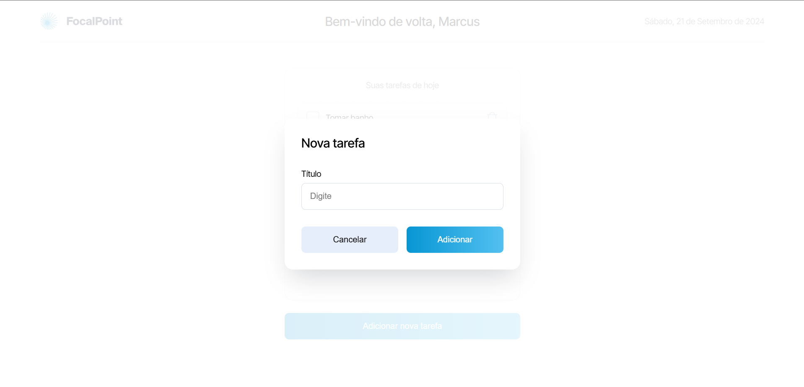
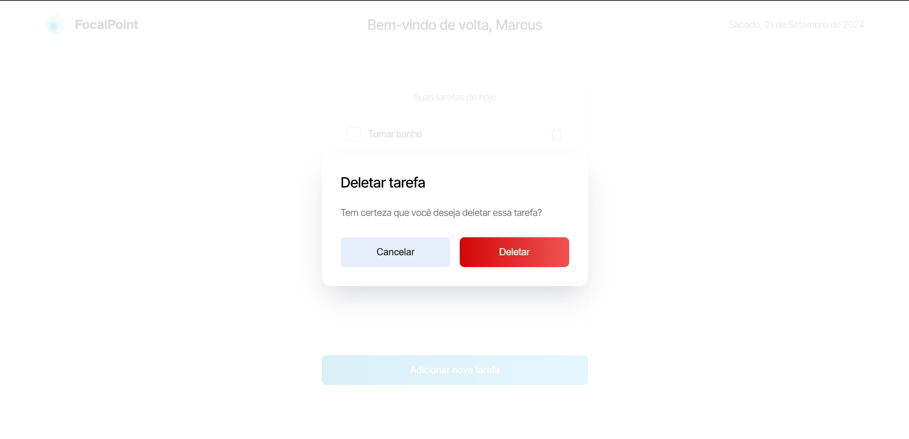

# Focalpoint

Focalpoint é uma aplicação de lista de tarefas (todo list) desenvolvida com Next.js, utilizando create-next-app. Esta aplicação permite criar tarefas, marcá-las como feitas e deletá-las.



## Tecnologias Usadas

- **Next.js**: Framework React para desenvolvimento de aplicações web.
- **Sass**: Pré-processador CSS que facilita a escrita de estilos.
- **TypeScript**: Superset do JavaScript que adiciona tipagem estática.
- **localStorage**: API do navegador para armazenar dados localmente no cliente.

## Começando

Para começar, execute o servidor de desenvolvimento:

```bash
npm run dev
# ou
yarn dev
# ou
pnpm dev
# ou
bun dev
```
Abra http://localhost:3000 no seu navegador para ver o resultado.
## Projecto
 </br>
 </br>
